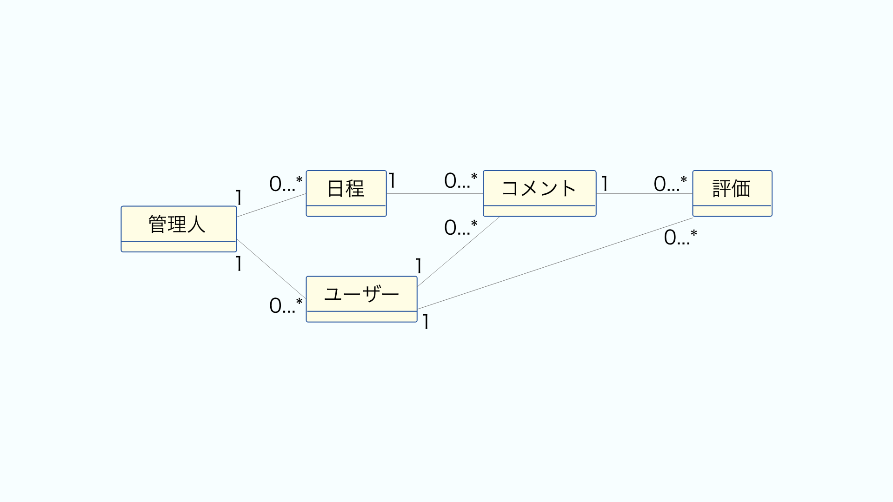

# １：ユースケース

サッカーチーム掲示板の基本的な要求。
* サッカーチームの試合結果に、ログインしたユーザーがコメントとイイねを付けることができる。
* ログインしていない人は閲覧のみができる。

具体的なユースケース（実際にシステムがユーザーに利用される際のやりとり）。
* 某月某日の試合結果に、Twitter／GitHub／Facebookアカウントを持っているユーザーがコメントを投稿。他投稿にイイねする。
* 個別試合ページをTwitterで拡散したりする。
など。
サービスの名前は、「予定調整くん」で、プロジェクト名は、schedule-arrangerとしましょう。
サービスの内容は、予定の出欠表があると思いますが、それを Web 上に表現したものがこの要求を満たすのに便利なものとなりそうです。

|      サービス名      | プロジェクト名 | アカウント名 |  サービス内容  |
| :------------------: | :------------: | :----------: | :------------: |
| 湘南ベルマーレ掲示板 |   Bell-Board   |  @bellboard  | コメント掲示板 |

# ２：要件定義／用語定義

## 【要件定義】

* 試合予定／結果が管理できる
* 試合結果に対してコメント／削除できる
* 「イイね」を付ける／外すことができる
* 管理人によってコメントを削除できる

以上のような要件は、機能要件とも呼ばれ、要求を満たすための機能があることを定義したものとなっています。
なお機能要件ではないもののことを非機能要件といいます。非機能要件には、機能に付随する性能に対する要件や、セキュリティに関する要件があります。
ここで非機能要件の定義は割愛します。

## 【用語定義】
|   用語   |  英語表記  |                 意味                 |
| :------: | :--------: | :----------------------------------: |
|  管理者  |   admin    |      試合情報とコメントの管理者      |
| ユーザー |    user    |          ログインした利用者          |
|   日程   |  fixture   |              試合の日程              |
|   投稿   |    post    | 試合に対してユーザーがつけるコメント |
|   評価   | evaluation |      コメントに対する「イイね」      |

このような、システムの中に登場する用語と意味をしっかりと定義するということは、ソフトウェアづくりの中で非常に重要なことです。

これは、複数人でシステムを作るときに特に重要なのですが、
自分一人でプログラミングする場合においても、コードの中での言葉の表す対象の意味がぶれると思わぬ実装ミスを招いてしまいます。

そのようなミスを防ぐためにも、複雑なソフトウェアを作る際には、使う用語の定義を用語集やコードのコメント内にしっかりまとめておきましょう。

# ３：データモデリング
先ほど紹介した用語はすべて、データベース上におけるエンティティとみなして良いでしょう。

エンティティ同士の関係を表すと以下の ER 図のようになります。
わかりやすさを重視するために、概念スキーマという形で日本語で表記してあります。

主キーや外部キーなどの属性は全て省いて、エンティティ名だけで書いています。

中心となるエンティティは管理人とユーザーです。

管理人は、日程とユーザーそれぞれと「1 対 多」の関連を持っています。
ユーザーは、コメントと評価それぞれと「1 対 多」の関連を持っています。

* 管理人は、日程を作成／編集できる
* ユーザーはコメントを投稿／削除できる
* ユーザーはコメントへの評価の有無を操作できる
* 管理人は、ユーザーのコメントを削除する権限がある

以上の要件があるため、この関係は妥当だと言えます。
またこの関係から、コメント、評価はそれぞれ、ユーザーに従属しています。
しかし、日程とユーザーがそれぞれ管理人に従属していません。これは管理人による権限によって管理される関係なので、データを従属させる必要はないからです。

そのためこれらの関係を表す線には、 1 と 0 から N を表す 0..n が記載されています。この関係は「1 対 多」の関連における従属を表す ER 図の線の書き方です。

次に日程は、コメントと `「1 対 多」`の関連を持っています。これも、

* 日程には、ユーザーによってコメントが投稿できる
この要件を満たすために必要な要件であると言えます。
同様に、コメントは日程に従属しています。

そしてコメントは、評価と`「1 対 多」`の関連を持っています。

* コメントに対して、ユーザーは評価をできる
という要件があるためこれも必要でしょう。
同様に評価はコメントが存在しないとできないため、これも評価がコメントの従属エンティティだということができるでしょう。

さて、このようにデータモデルができたところで、先ほどの基本的な要件が満たされるのかを確認してみます。

* 試合予定／結果が管理できる
* 試合結果に対してコメント／削除できる
* 「イイね」を付ける／外すことができる
* 管理人によってコメントを削除できる

どうやらこのデータモデルで、管理人／ユーザーが上記の要件を実施することができそうです。
ではこのデータモデルで実装を行っていきましょう。

なお、このようにデータモデルなどの設計を行っていますが、実際に実装で都合が悪いところが出てきたら、それにあわせてデータモデルは変更していきます。
このような設計は、設計通りにしっかりと作ることが重要なのではなく、設計をすることによって、要件に漏れがないかや、根本的な仕組みに問題がないかをチェックすることが目的です。ですので、設計したら必ずこの通りに作らなくてはいけない、というわけではありません。このことに気をつけながら、設計を行っていきます。

# 4：URL設計

ページ構成
* トップページ
* 最新試合ページ
* 個別日程ページ
* 試合一覧ページ
* 日程作成ページ
* 日程編集ページ
* コメントページ

ログインとログアウトのページは省いています。

ただし、機能的に一緒であっても問題なさそうなページがありそうですので、まとめてみましょう。

* トップ/最新試合／コメントページ
* 個別日程/コメントページ
* 試合一覧ページ
* 日程作成ページ
* 日程編集ページ
このようにまとめられそうです。

日程作成、編集ページは管理人のみ開けるといいでしょう。普通の HTML フォームで実現できそうです。ユーザーも試合情報を更新できるのも、一つの仕様としては良いかもしれません。

コメントへの評価は `AJAX` を利用して「イイね」できると、利便性があがります。

これらを踏まえて、メソッドと URL のパス、内容をまとめると以下の表のようになります。

# ５：ページのURL一覧
| パス                      | メソッド | ページ内容                      |
| ------------------------- | -------- | ------------------------------- |
| /                         | GET      | トップ/最新試合／コメントページ |
| /fixtures                 | GET      | 試合一覧ページ                  |
| /fixtures/:fixtureId      | GET      | 個別日程/コメントページ         |
| /fixtures/:fixtureId/edit | GET      | 日程編集ページ                  |
| /fixtures/new             | GET      | 日程作成ページ                  |
| /login                    | GET      | ログイン                        |
| /logout                   | GET      | ログアウト                      |

表のパスにでてきている`:fixtureId` は、日程エンティティの主キーとします。
続けて、ページではなく、フォームの投稿先やAjaxで利用するWebAPI の URLも設計します。

# ６：Web API の URL一覧
| パス                                             | メソッド | 処理内容       | 利用方法 |
| ------------------------------------------------ | -------- | -------------- | -------- |
| /insert                                          | POST     | 日程挿入       | AJAX     |
| /fixtures                                        | POST     | 日程作成       | フォーム |
| /fixtures/:fixtureId?edit=1                      | POST     | 日程編集       | フォーム |
| /fixtures/:fixtureId?delete=1                    | POST     | 日程削除       | フォーム |
| /fixtures/:fixtureId/posts/                      | POST     | コメント       | フォーム |
| /fixtures/:fixtureId/posts/:postId?delete=1      | POST     | コメントの削除 | フォーム |
| /fixtures/:fixtureId/posts/:postId/users/:userId | POST     | イイね         | AJAX     |

* メソッドを全て POST にしました。
* :userId は、ユーザーエンティティの主キー、 /:postId はコメントエンティティの主キーとします。
* AJAX などで利用する Web API の設計には、様々な設計思想やツールがありますが、ここでは紹介を割愛します。

大枠の URL 設計を経ることによって、全体として統制が取れ、わかりやすい URL を設計することができます。
セキュリティの要件やパフォーマンス上の要件などの技術的制約により URL 設計が影響を受けることがあり、それらは詳細な実装の前には想定しづらいです。そのため、場当たり的にどんどん作っていきたいという考えもありますが、さすがに何も考えなしに作成していくと、全体の URL 設計の統一がなされず非常にわかりづらい URL 構成になってしまいがちです。

ここまではインタフェースの設計でした。
ここからはモジュールの設計も行いましょう。
# ７：モジュール設計
Web フレームワークの Express を利用する前提に立つことでずいぶんとモジュール設計コストを下げることができます。

URL 設計にそって、 /routes ディレクトリ以下の Router モジュールを以下のように用意すればよいでしょう。
データモデルやデータストアへの永続化に関しては、 /models というディレクトリを作成し、それぞれのエンティティごとにファイルを定義します。
## 7.1：Router モジュール一覧
| ファイル名 | 責務  |
| ----- | --- |
|       |     |
|       |     |
|       |     |
|       |     |
このように責務を分割しましょう。

それぞれの責務は独立性と凝集性が高く、分離しやすいため、上記のようなモジュール構成で作ることがより効率的に開発することができます。

このように Web フレームワークを用いることで、おきまりのモジュール構成の形式にしたがって設計を考えることができるため、設計の段階でもずいぶん楽をすることができます。

## 7.2：データモデルモジュール一覧

| ファイル名 | 責務  |
| ----- | --- |
|       |     |
|       |     |
|       |     |
|       |     |

今回は永続化には、 sequelize というライブラリを用います。
上記の表では、データモデルで決定したエンティティの設計に沿ってモジュール分割を行っています。

これで JavaScript で利用するモジュールは、/routesと/modelsディレクトリ以下にそれぞれモジュール分割することができました。

なお、このように、リクエストのルーティングを行い処理をコントロールする部分と、エンティティのモデリングや振る舞い、永続化などの処理をする部分と、表示内容の形式を定義する部分を分割する構造のことを MVC といいます。